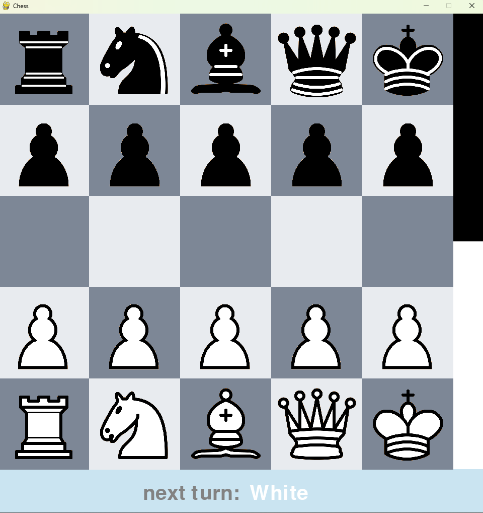

# ChessAi with Deep Q-Learning



# Table of Contents
1. [Game Rules](#Game-Rules)
2. [Installation and Usage](#Installation-and-Usage)
    1. [Installation Instructions](#Installation-Instructions)
    2. [Required Packages and Versions](#Required-Packages-and-Versions)
    3. [Usage Guide](#Usage-Guide)

----

## Game Rules
The game follows standard chess rules with the following exceptions:
- Castling is not allowed.
- En passant moves are not available.
- Pawns can only be promoted to queens.
- The game is won by capturing the opponent's king.
- A draw occurs if no pawn moves or captures are made within 20 consecutive moves.

----

## Installation and Usage

### Installation Instructions
- Clone the repository.
- Install the necessary dependencies. If you have Conda and would like to utilize a GPU (available only on WSL2/Linux systems), you can create a Conda environment using the `ChessAi.yml` file with the following command:

```bash
conda env create -f ChessAi.yml
```

- In the event of an error during the loading of the pretrained model, it can be resolved by manually downloading and replacing the `saves\pretrained\ChessAi_model_main_checkpoint\keras_metadata.pb` file. This issue is caused by a known Git bug and is outside of our control.
- **Important:** The pretrained model files could not be uploaded directly to the repository due to size limitations. Please download the necessary model files from the following Google Drive link and extract them into the root directory of the project:
[Download Pretrained Model Files](https://drive.google.com/drive/folders/15tKfkTosqflaKJ54hZbXUa1A5Cf2yqr2?usp=sharing)

### Required Packages and Versions
All required packages and their specific versions are listed in the `requirements.txt` file. Please install them accordingly.

### Usage Guide
- Execute `training.py` to initiate model training. You may either train a new model from scratch or continue training the provided pretrained model.
- Training progress and evaluations are visualized and saved as matplotlib plots in the directory `saves/modelName/ChessAi_training_graph`.
- Execute `play.py` to either play against a model or observe two models competing against each other.
- More detailed explanations and options for configuring matches between models are available within the scripts.
